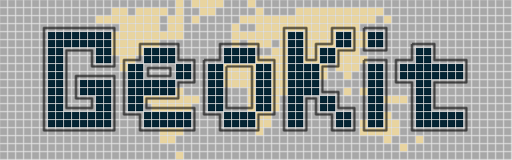

<table style="border:0; border-collapse:collapse;">
  <tr>
    <td>
      <a href="https://geokit.readthedocs.io/latest/">
        
      </a>
    </td>
    <td>
      <a href="https://www.fz-juelich.de/en/ice/ice-2">
        
      </a>
    </td>
  </tr>
</table>


| Name                                                                                                             | Version                                                                                                             | Tests                                                                                                                                                                                                    | Pytest Coverage                                                                                                                                                 | Docstring Style                                                                  | Documentation Coverage                                  |
| ---------------------------------------------------------------------------------------------------------------- | ------------------------------------------------------------------------------------------------------------------- | -------------------------------------------------------------------------------------------------------------------------------------------------------------------------------------------------------- | --------------------------------------------------------------------------------------------------------------------------------------------------------------- | -------------------------------------------------------------------------------- | ------------------------------------------------------- |
| [](https://anaconda.org/conda-forge/geokit) | [](https://anaconda.org/conda-forge/geokit) | [](https://github.com/FZJ-IEK3-VSA/geokit/actions/workflows/test_push.yml) | [](https://codecov.io/gh/FZJ-IEK3-VSA/geokit) |  |  |


---

<!-- readme-only:start -->
📖 **Read the full documentation at [geokit.readthedocs.io](https://geokit.readthedocs.io/).**
<!-- readme-only:end -->

## Documentation Overview

ETHOS.GeoKit is a Python toolkit for efficiently handling geospatial data and spatial operations. Its **main advantage is the seamless combination of raster and vector data**: through the **RegionMask** and **Extent** objects, datasets in different formats, resolutions, and coordinate reference systems are integrated into the context of a single region of interest — without the manual CRS, extent, and resolution bookkeeping this normally requires. It is [scientifically reviewed and published](https://doi.org/10.1016/j.softx.2026.102870).

ETHOS.GeoKit equally supports the individual building blocks on their own, so it works just as well for pure raster or pure vector tasks:
- Reading, writing, and mutating vector and raster datasets
- Manipulating and translating geometries between coordinate systems
- Warping and resampling raster data, and sampling values at point locations
- Converting between raster and vector representations (rasterize / polygonize)
- Seamlessly integrating multiple raster and vector datasets within a region through the **RegionMask** object

New here? See [Why ETHOS.GeoKit?](https://geokit.readthedocs.io/why_geokit.html) for how it compares to GDAL, GeoPandas, and Rasterio — and how much less code it takes to achieve the same result.

ETHOS.GeoKit is part of the [ETHOS (**E**nergy **T**ransformation **P**at**H**way **O**ptimization **S**uite)](https://www.fz-juelich.de/de/ice/ice-2/leistungen/model-services). ETHOS.GeoKit is, for example, directly used in [GLAES](https://github.com/FZJ-IEK3-VSA/glaes) and [RESKit](https://github.com/FZJ-IEK3-VSA/reskit).

## Installation

If you just want to use ETHOS.GeoKit, install it from Conda Forge. To download and execute all the examples or develop the source code, install it from source. Both installations require conda or mamba, which can be used interchangeably. We recommend the [Miniforge installer](https://conda-forge.org/download/). Please remove other conda installers if you decide to use miniforge.  Having multiple conda installs on your machine will likely cause issues.

### Installation via conda-forge (Recommended)

The easiest way to install ETHOS.GeoKit into a new environment is from `conda-forge`:

```bash
conda create -n geokit -c conda-forge geokit
```

Or into an existing environment with:

```bash
conda install -c conda-forge geokit
```

### Installation from Source

1. Clone the repository and navigate to it:

```bash
git clone https://github.com/FZJ-IEK3-VSA/geokit.git
cd geokit
```

2. (Optional) Switch to the development branch:

```bash
git checkout dev
```

3. Create a new environment:

```bash
conda env create --file requirements-dev
conda activate geokit
pip install . --no-deps
```

4. (Alternative) Update an existing environment:

```bash
conda env update --file requirements-dev -n <ENVIRONMENT-NAME>
conda activate geokit
pip install . --no-deps
```

## Getting Started

The best way to learn ETHOS.GeoKit is through hands-on examples. This documentation includes:

- **Example notebooks** in the `docs/Examples` folder demonstrating real-world use cases
- **Detailed guides** in the `docs/example_articles` folder explaining key concepts
- **API documentation** providing comprehensive reference information
- **Source code** in the `geokit` folder for advanced users

Start with the [Introduction to ETHOS.GeoKit](docs/example_articles/_00_introduction.md) to understand the fundamentals, or jump directly to the capability area that interests you most.


## Citation

If you use or reference ETHOS.GeoKit in your research, please cite our [SoftwareX article](https://doi.org/10.1016/j.softx.2026.102870):

> Ishmam, S., Belina, J., Winkler, C., Weinand, J. M., Pflugradt, N., Heinrichs, H., & Linßen, J. (2026). ETHOS.GeoKit: A Python toolkit for analyzing and altering geospatial data for energy systems modeling and beyond. *SoftwareX*, 35, 102870. https://doi.org/10.1016/j.softx.2026.102870

```bibtex
@article{ishmam2026geokit,
  title   = {{ETHOS.GeoKit}: A {P}ython toolkit for analyzing and altering geospatial data for energy systems modeling and beyond},
  author  = {Ishmam, Shitab and Belina, Julian and Winkler, Christoph and Weinand, Jann M. and Pflugradt, Noah and Heinrichs, Heidi and Lin{\ss}en, Jochen},
  journal = {SoftwareX},
  volume  = {35},
  pages   = {102870},
  year    = {2026},
  publisher = {Elsevier},
  doi     = {10.1016/j.softx.2026.102870}
}
```

## Contributions and Support
All contributions are welcome:
- If you have a question, want to report a bug, or have a feature request, please open an [Issue](https://github.com/FZJ-IEK3-VSA/geokit/issues/new). We will then take care of the issue as soon as possible.
- If you want to contribute with additional features or code improvements, open a [Pull request](https://github.com/FZJ-IEK3-VSA/geokit/pulls).

## License

MIT License

Active developers: Christoph Winkler, Shitab Ishmam, Julian Belina, Noah Pflugradt, Heidi Heinrichs, Jochen Linßen, Detlef Stolten

Alumni: David Severin Ryberg, Martin Robinius, Stanley Risch, Julian Schönau, Rachel Maier, David Franzmann

You should have received a copy of the MIT License along with this program.  
If not, see <https://opensource.org/licenses/MIT>

## About Us 

We are the <a href="https://www.fz-juelich.de/en/ice/ice-2">Institute of Climate and Energy Systems – Jülich Systems Analysis (ICE-2)</a> at the <a href="https://www.fz-juelich.de/en"> Forschungszentrum Jülich</a>.
Our work focuses on independent, interdisciplinary research in energy, bioeconomy, infrastructure, and sustainability. We support a just, greenhouse gas–neutral transformation through open models and policy-relevant science.

## Code of Conduct
Please respect our [code of conduct](https://github.com/FZJ-IEK3-VSA/README_assets/blob/main/CODE_CONDUCT.md).


## Acknowledgment

This work received primary support from the Helmholtz Association through the Joint Initiative ["Energy System 2050: A Contribution of the Research Field Energy"](https://www.helmholtz.de/en/research/energy/energy_system_2050/) and the program ["Energy System Design"](https://www.helmholtz.de/en/research/research-fields/energy/energy-system-design/). Additionally, parts of this work were supported by the [H2Atlas-Africa project (03EW0001)](https://www.fz-juelich.de/de/ice/ice-2/projekte/h2-atlas-africa), funded by the German Federal Ministry of Research, Technology, and Space (BMFTR).


<a href="https://www.helmholtz.de/en/">
  <picture>
    <source media="(prefers-color-scheme: dark)" srcset="https://raw.githubusercontent.com/FZJ-IEK3-VSA/README_assets/v.1.0.0/Helmholtz_Logos/Helmholtz-Logo-White-RGB.svg">
    <source media="(prefers-color-scheme: light)" srcset="https://raw.githubusercontent.com/FZJ-IEK3-VSA/README_assets/v.1.0.0/Helmholtz_Logos/Helmholtz-Logo-Dark-Blue-RGB.svg">
    
  </picture>
</a>


