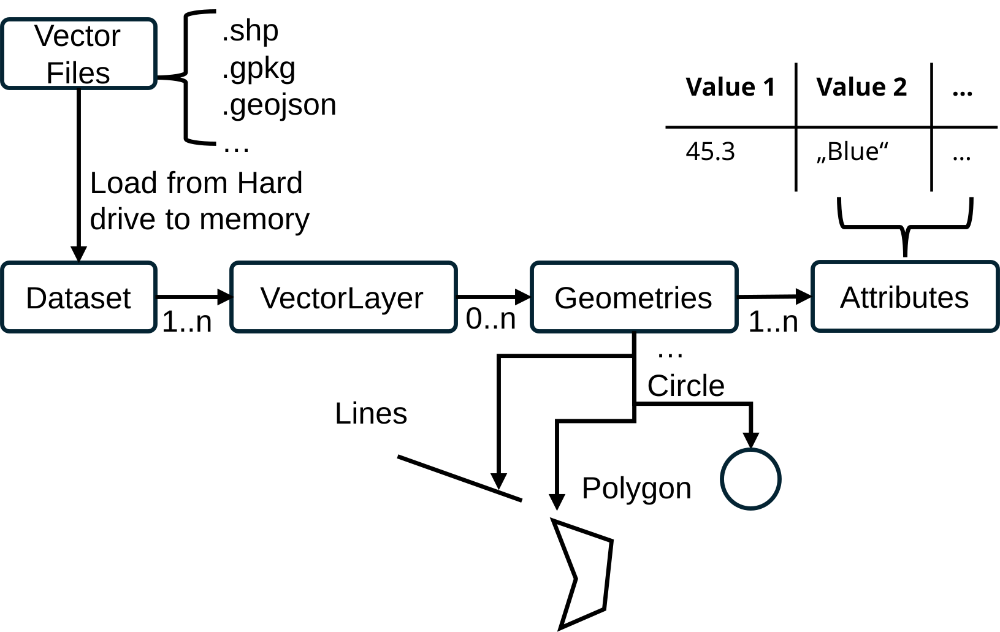

# Working with Vector Files

Vector datasets store geometries together with attribute data in a table-like structure.
Each row represents a geographic feature, while one column contains the geometry and the remaining columns store descriptive attributes.
Vector data is commonly stored in formats such as Shapefiles or GeoPackages, which define how geometries, attributes, and coordinate reference systems are stored.

### General structure of vector data

The figure above summarizes how vector data is organized on disk. A vector dataset is made up of:

- Geometry files that stores the actual shapes (points, lines, polygons)
- Attribute tables that hold descriptive fields for each feature.
- A coordinate reference system definition, which tells software how to interpret coordinates.
- Optional index or metadata files that speed up access and record provenance.

Together, these components form a single logical dataset: a table of features with geometry plus attributes. The exact set of files depends on the format (e.g., Shapefile uses multiple sidecar files, while GeoPackage stores everything in one container), but the logical structure is the same.

## GeoKit Vector Capabilities

GeoKit provides comprehensive tools for working with vector data, enabling you to read, analyze, manipulate, and visualize geospatial features. The library supports common vector formats and offers functionality for both simple and advanced spatial operations.

### Reading and Analyzing Vector Files

GeoKit supports reading and working with multiple vector file formats:

- **Shapefiles** – The [Analyzing Shapefiles](../../Examples/_02_vector/_1_analyze_shape_files.ipynb) example demonstrates how to load and inspect Shapefile datasets, which consist of multiple component files (.shp, .dbf, .shx, .prj) that must be kept together.

- **GeoPackages** – The [Analyzing GeoPackages](../../Examples/_02_vector/_2_analyze_geopackage.ipynb) example shows how to work with GeoPackage files (.gpkg), which store all data in a single container and can hold multiple vector layers.

### Visualization

GeoKit makes it easy to visualize vector data:

- **Basic Visualization** – The [Visualizing Vector Data](../../Examples/_02_vector/_3_visualize_vector_data.ipynb) example demonstrates how to plot vector datasets and overlay multiple vector files to explore spatial relationships and compare features.

### Attribute Management

Vector datasets combine spatial geometries with descriptive attributes:

- **Attribute Extraction and Manipulation** – The [Attribute Operations](../../Examples/_02_vector/_4_attribute_extraction_and_manipulation.ipynb) example shows how to extract existing attributes, calculate new properties (like area), and add custom attribute columns to your vector datasets.

### Spatial Operations

GeoKit provides powerful tools for spatial analysis and manipulation:

- **Spatial Filtering** – The [Spatial Filtering](../../Examples/_02_vector/_5_filter_vector_data_spatially.ipynb) example demonstrates how to filter vector data based on spatial relationships and clip geometries to specific regions of interest.

- **Buffering** – The [Creating Buffers](../../Examples/_02_vector/_6_create_buffer.ipynb) example shows how to create buffer zones around geometries, useful for analyzing exclusion zones or proximity relationships.

- **Subdividing Geometries** – The [Subdividing Geometries](../../Examples/_02_vector/_7_subdivide_geometries.ipynb) example demonstrates how to break down large geometries into smaller tiled regions using the tileize function.

These capabilities make GeoKit a versatile tool for vector data processing workflows, from simple data inspection to complex spatial analysis tasks.

